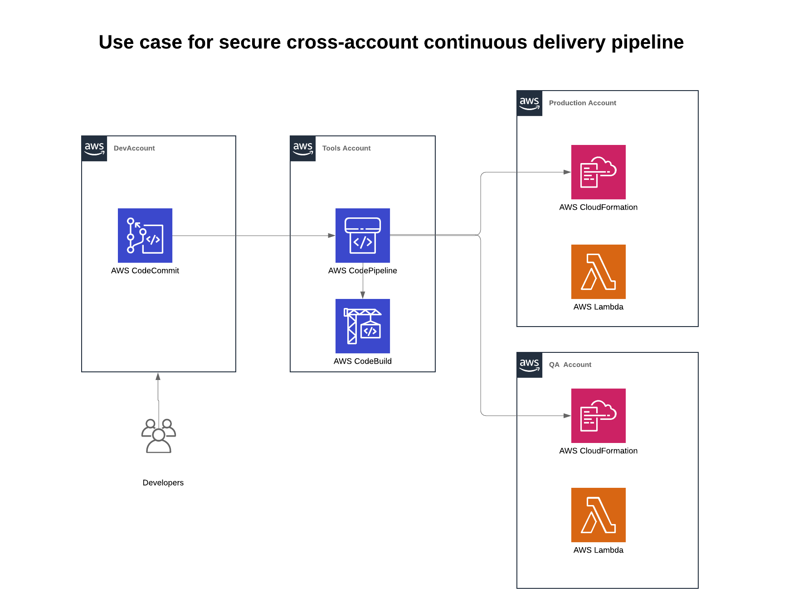

# Reference Architecture: Cross Account AWS CodePipeline

This reference architecture demonstrates how to push code hosted in [AWS CodeCommit](code-commit-url) repository in Development Account,
use [AWS CodeBuild](code-build-url) to do application build, store the output artifacts in S3Bucket and deploy these artifacts to Test
and Production Accounts using [AWS CloudFormation](clouformation-url). This orchestration of code movement from code checkin to deployment
is securely handled by [AWS CodePipeline](code-pipeline-url).




## Running the sample

1. Clone the this repo
1. Login to: https://sarmaks-lz.awsapps.com/start#/ with credentials given to you during the session. You can use one of the following as user-name and pick the number assigned to during the session:
```
    sarmaks+reinforce-1@amazon.com
    sarmaks+reinforce-2@amazon.com
    sarmaks+reinforce-3@amazon.com
    sarmaks+reinforce-4@amazon.com
    sarmaks+reinforce-5@amazon.com
    sarmaks+reinforce-6@amazon.com
```
1. Update your ~/.aws/config with aws-profile information

```
[profile reinforce-ssd-336-tools]
aws_access_key_id = xxx
aws_secret_access_key = xxx
aws_session_token = xxxx
output = json
region = us-east-1

[profile reinforce-ssd-336-dev]
aws_access_key_id = xxx
aws_secret_access_key = xxx
aws_session_token = xxxx
output = json
region = us-east-1

[profile reinforce-ssd-336-qa]
aws_access_key_id = xxx
aws_secret_access_key = xxx
aws_session_token = xxxx
output = json
region = us-east-1

[profile reinforce-ssd-336-prod]
aws_access_key_id = xxx
aws_secret_access_key = xxx
aws_session_token = xxxx
output = json
region = us-east-1
```

### Update ~/.gitconfig

```
[credential]
  helper = !aws --profile reinforce-ssd-336-dev codecommit credential-helper $@
  UseHttpPath = true

```
### Run the script

```
./single-click-cross-account-pipeline.sh

```
#### Clone the sample Lambda function GitHub repository

[Clone](https://help.github.com/articles/cloning-a-repository/) the [AWS LAMBDA sample application](https://github.com/awslabs/aws-pipeline-to-service-catalog.git) GitHub repository.

From your terminal application, execute the following command:

```console
git clone https://github.com/awslabs/aws-pipeline-to-service-catalog.git
cd aws-pipeline-to-service-catalog

```

This creates a directory named `aws-pipeline-to-service-catalog` in your current directory, which contains the code for the AWS Lambda function sample application.

#### Add a new remote

From your terminal application, execute the following command:

```console
git remote add AWSCodeCommit https://git-codecommit.us-east-1.amazonaws.com/v1/repos/sample-lambda
```

Follow the instructions [here](http://docs.aws.amazon.com/codecommit/latest/userguide/setting-up.html) for local git setup required to push code to CodeCommit repository.

#### 4. Push the code AWS CodeCommit

From your terminal application, execute the following command:

```console
git push AWSCodeCommit master
```

[code-commit-url]: https://aws.amazon.com/devops/continuous-delivery/
[code-build-url]: https://aws.amazon.com/codebuild/
[code-pipeline-url]: https://aws.amazon.com/codepipeline/
[clouformation-url]: https://aws.amazon.com/cloudformation/
[lambda-url]: https://aws.amazon.com/lambda/
